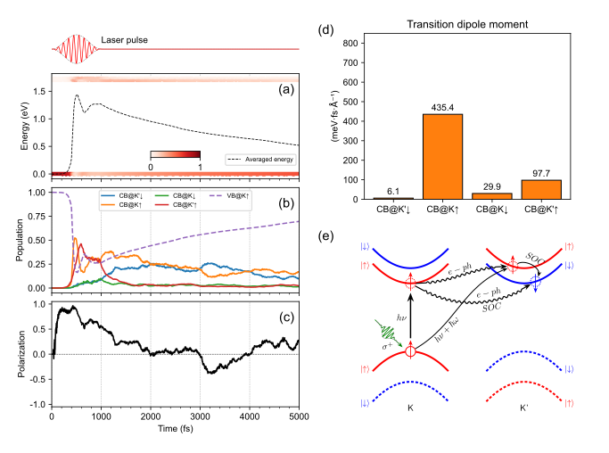

# Introduction

NAMD-LMI is a subset of [Hefei-NAMD](https://hefei-namd.org/code/) with
light-matter interaction (LMI) support.

> Hefei-NAMD is an _ab initio_ non-adiabatic molecular dynamics program to
> investigate the ultrafast excited carrier dynamics in real and momentum
> space, energy and time scale.

Now NAMD-LMI is capable to

- Study carrier dynamics in real space and energy relaxation without laser
  field at finite temperture;
- Study photo-excitaion process and stimulated emission process and carrier
  dynamics in the laser field at zero temperature;
- Study carrier dynamics both under the perturbation of phonon and LMI.

**You may need watch the former tutorials to learn the basic concept and
procedures of Hefei-NAMD** in the following pages:

- [Basic Hefei-NAMD](https://www.bilibili.com/video/BV1p5411c7RS/)
- [Hefei-NAMD with CA-NAC](https://www.bilibili.com/video/BV1eo4y1m7yb/)
- [Hefei-NAMD with excitonic effects](https://www.bilibili.com/video/BV1iV411E7TF/)

