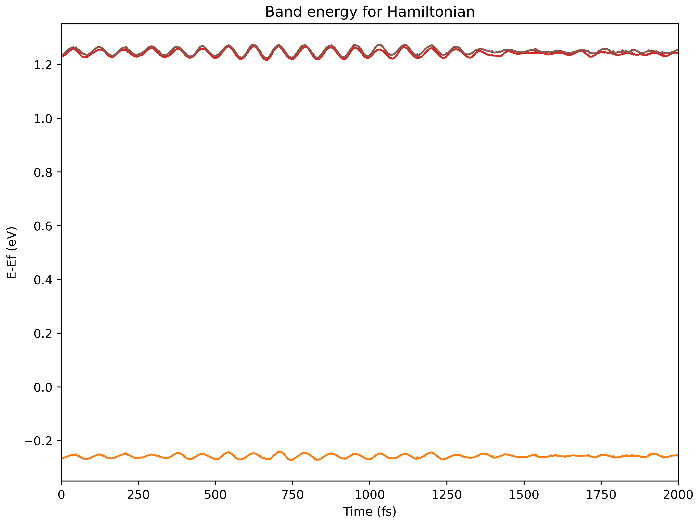
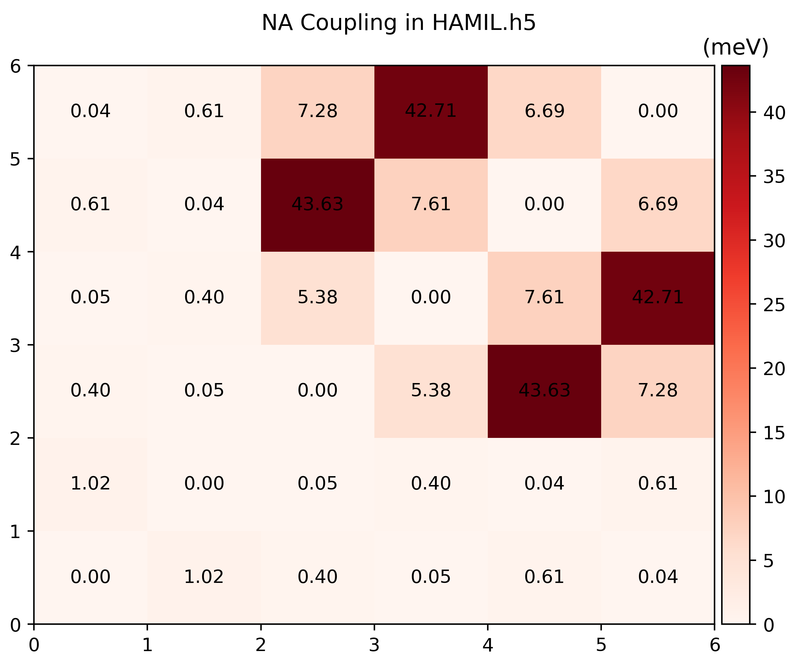
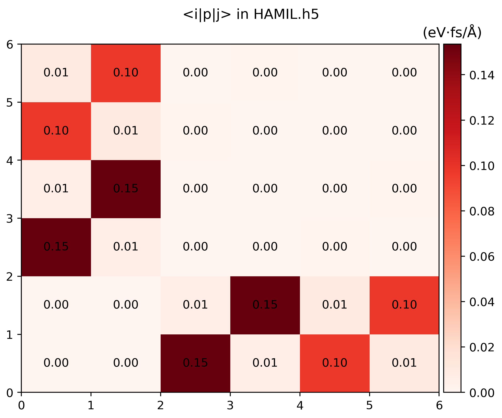

# Hamiltonian

The Hamiltonian here is simply a cropped coupling of the Non-adiabatic
couplings plus the external field.

The total Hamiltonian of `namd_lmi` consists of three parts:
\begin{equation}
    \mathcal{H} = \mathcal{H}^0 + \mathcal{H}^{NAC} + \mathcal{H}^{LMI}
\end{equation}
where \\(\mathcal{H}^0\\) is just eigenvalues of KS orbitals and
\\(\mathcal{H}^{NAC}\_{jk} = -i\hbar \mathbf{D}\_{jk}\\) models the _e-ph_ and
spin-orbit coupling (if `LSORBIT=.TRUE.` is used). The LMI term reads
\\(\mathcal{H}\_{jk}^{\mathrm{LMI}} = -e \frac{\mathbf{A}}{m\_e} \mel{j}{\mathbf{p}}{k}\\).
The vector potential term \\(\mathbf{A}\\) is calculated by integrating the external
electric field
\begin{equation}
    \mathbf{A}(t) = - \int\_0^t \mathbf{E}(t') \dd t'
\end{equation}


## Help message

```shell
$ namd_lmi hamil --help
Generate the Hamiltonian from NAC according to config file

Usage: namd_lmi hamil [OPTIONS]

Options:
  -c, --config <CONFIG>
          Config file name.

          Aliases: "cfg", "conf".

          [default: hamil_config.toml]

      --generate <GENERATE>
          Generate auxiliary files for the calculation and analysis.

          The generation of Hamiltonian will not run if this flag is set.

          Alias: "gen".

          Possible values:
          - config-template:      Generate config template for Hamiltonian generation. Aliases: "config", "cfg" and "conf"
          - efield-template:      Generate script template for external electric field. Aliases: "efield", "ef"
          - postprocess-template: Generate post-process scripts for Hamiltonian analysis. Aliases: "post-process", "postprocess", "pp"

  -h, --help
          Print help (see a summary with '-h')
```

## Procedures

1. Generate a configuration template, and an optical field description file

    ```shell
    $ namd_lmi hamil --generate conf
    2024-11-19 21:49:48 [ INFO] Global logger initialized with targets being stderr and "./globalrun.log"
    2024-11-19 21:49:48 [ INFO] Writing `02_hamil_config_template.toml` ...
    2024-11-19 21:49:48 [ INFO] Writing config to file "02_hamil_config_template.toml"
    2024-11-19 21:49:48 [ INFO] Time used: 1.624654ms

    $ namd_lmi hamil --generate efield
    2024-11-20 11:34:14 [ INFO] Global logger initialized with targets being stderr and "./globalrun.log"
    2024-11-20 11:34:14 [ INFO] Writing `efield_template.rhai` ...
    2024-11-20 11:34:14 [ INFO] Time used: 977.069µs
    ```

2. Modify the Hamiltonian configuration file and optical description file

    - **Hamiltonian configuration**

        The file `02_hamil_config.toml` should read

        ```toml
        # NAMD-lmi config for Hamiltonian generation

              ikpoint = 1
           basis_list = "215..220"
         basis_labels = ["VBM-1", "VBM", "CBM", "CBM+1", "CBM+2", "CBM+3"]
            nac_fname = "NAC.h5"
         efield_fname = "./efield.rhai"
          hamil_fname = "HAMIL.h5"
           propmethod = "Expm"
              scissor = 1.5 # unit: eV
        ```

        Explanation of each field:

        - `ikpoint` _integer_: K point index, consistent with NAC's configuration.
        - `basis_list` _string_: **THIS FIELD SHOULD BE A STRING.**, list of bands to form the basis.
            
            - Positive one indicates the spin-up band;
            - Negative one indicates the spin-down band.
            - Zeros are not allowed
            
            You can specify a consecutive bands with multiple `range`s or singletons:
            
            A `range` is a pattern of `start..end` where

              - start and end are integers with same sign (both + or both -)
              - |start| <= |end|
              - no other characters (whitespace or any other thinds) around `..`
            
            And multiple ranges and singletons are separated with one or more whitespaces.
            
            EXAMPLE:

              - `1..4` expands to `[1, 2, 3, 4]`;
              - `1..1` expands to `[1]`;
              - `4..1` expands to empty list `[]`;
            
              - `-1..-4` expands to `[-1, -2, -3, -4]`.
              - `-4..-4` expands to `[-4]`
              - `-4..-1` expands to empty list `[]`;
            
              - Tokens like `-4..4` `1 ..3`, `0`, `-3..0`, `-3..3` are not allowed.
                
            `"-1..-4 1..4"` expands to `[-1, -2, -3, -4, 1, ,2 , 3, 4]`, and meaning that band
            1 to 4 with spin down and band 1 to 4 with spin up form the total basis.
            

        - `basis_labels` _list of strings_: Labels of each band in the basis. This field is optional,
            or it must have the same length with expanded `basis_list`.
        - `nac_fname` _string_: File name of the pre-calculated NAC by last procedure (`namd_lmi nac -c config`).
        - `efield_fname` _string_: Name of the optical field description file. If no optical field
            is applied, this field can be commented out.
        - `hamil_fname` _string_: File name of output Hamiltonian.
        - `propmethod` _string_: Numerical method to solve of time-dependent Schrodinger equation (TDSE).
            Here are supported methods:
            - `Expm`: Matrix exponentiation by [Padé approximant](https://en.wikipedia.org/wiki/Pad%C3%A9_approximant).
            - `Exact`: Matrix power by [diagonalization](https://en.wikipedia.org/wiki/Diagonalizable_matrix).
            - `FiniteDifference/FD`: Solve TDSE using finite difference method. **This method usually requires fine
                time steps in the next step**.
            - `LiouvilleTrotter/LT`: Using Trotter formula to solve TDSE, proposed by
                _Akimov, A. V., & Prezhdo, O. V. J. Chem. Theory Comput. 2014, 10, 2, 789–804_

            It should be noted that `Expm`, `Exact` are usually slow while they have large tolerance of time step,
            resulting in much higher performance beyond `FiniteDifference`. Large time step also can be used with
            `LiouvilleTrotter` method, while it requires the off-diagonal elements of Hamiltonian to be real, which
            are usually not viable for photo-excitation processes.

        - `scissor` _float_: Scissor opeartor for the gap correction. The photo-excitation process
            requires a high-precision time-averaged band gap over AIMD, and this parameter can modify
            the gap to target value.

    - **Optical field description**

        The `efield_template.rhai` should read like

        ```rhai
        //
        // Example rhai script for ELECTRIC FIELD input
        //
        // This script uses `rhai` as the scripting language.
        //
        // For detailed usage of `rhai`, please see https://rhai.rs/book and turn to
        // chapter "Scripting Language".
        //
        //
        // Available operators:
        //      +   +=
        //      -   -=
        //      *   *=
        //      /   /=
        //      %   %=      (modulo operator)
        //      **  **=     (power operator, `a ** b` equals `a` raised to the `b` power)
        //      ==  !=
        //      <   <=
        //      >   >=
        //      ..  ..=     ( .. is exclusive range, ..= is inclusive range )
        //                  example: (1 .. 9) == (1 ..= 8)
        //
        //      Detailed help: https://rhai.rs/book/language/num-op.html
        //
        // Pre-defined constants:
        //
        //      - e: Euler's number, aka the base of natural logarithms
        //      - pi: π
        //
        // Pre-defined mathematical functions:
        //
        //      - trigonometric:
        //          sin     cos     tan
        //          sinh    cosh    tanh
        //          asin    acos    atan
        //          asinh   acosh   atanh
        //
        //      - numerical:
        //          sqrt(x)
        //          exp(x) (base of E)
        //          ln(x) (base of E)
        //          log(x) (base of 10), or log(x, base)
        //
        //      - rounding:
        //          floor
        //          ceiling
        //          round
        //          int
        //          fraction
        //
        //      - conversion:
        //          to_degrees
        //          to_radians
        //
        //      - comparison:
        //          min
        //          max
        //
        //
        // You must define a function named `efield` with only one parameter typed with float64.
        //
        // And this function must return an array with exactly 3 float64 elements.
        //
        // This function will be evaluated from `t=0.0` to `t=namdtime*potim` (exclusive)
        //
        fn efield(t) {
            let hbar  = 0.658212;           // reduced planck constant (eV/fs)
            let amp   = 0.005;              // amplitude = 0.005 (Volt/Angstrom)
            let hnu   = 1.4;                // photon energy = h * nu = 1.4 (eV)
            let omega = hnu / hbar;         // omega = hnu / hbar (rad/fs)

            let x = amp * cos(omega * t);   // electric field at `x` direction at time `t`
            let y = amp * sin(omega * t);   // electric field at `y` direction at time `t`
            let z = 0.0;                    // no electric field at `z` direction

            return [x, y, z];               // this statement is required.
        } 
        ```
        where the contents after with `//` are just comments for rhai syntax illustration.
        
        This file describes an persistent uniform \\(\sigma^+\\) optical field, with
        \\(h\nu = 1.4 \mathrm{eV}\\), amplitude \\(A_0 = 0.005 \mathrm{V/Angstrom}\\).

        If you want to impose an optical pulse, an envelop function should be used
        before `return [x, y, z]`.

        For example, a Gaussian pulse:
        ```
        fn efield(t) {
            let hbar  = 0.658212;           // reduced planck constant (eV/fs)
            let amp   = 0.005;              // amplitude = 0.005 (Volt/Angstrom)
            let hnu   = 1.4;                // photon energy = h * nu = 1.4 (eV)
            let omega = hnu / hbar;         // omega = hnu / hbar (rad/fs)

            let x = amp * cos(omega * t);   // electric field at `x` direction at time `t`
            let y = amp * sin(omega * t);   // electric field at `y` direction at time `t`
            let z = 0.0;                    // no electric field at `z` direction

            let sigma = 1000.0;             // sigma of gaussian function, in femto second
            let mu    = 1000.0;             // center of the pulse, in femto second
            let envelop = exp(-(t-mu)**2 / sigma**2 / 2.0);

            return [x * envelop, y * envelop, z * envelop];
        } 
        ```

        a sine pulse:

        ```
        fn efield(t) {
            let hbar  = 0.658212;           // reduced planck constant (eV/fs)
            let amp   = 0.005;              // amplitude = 0.005 (Volt/Angstrom)
            let hnu   = 1.4;                // photon energy = h * nu = 1.4 (eV)
            let omega = hnu / hbar;         // omega = hnu / hbar (rad/fs)

            let x = amp * cos(omega * t);   // electric field at `x` direction at time `t`
            let y = amp * sin(omega * t);   // electric field at `y` direction at time `t`
            let z = 0.0;                    // no electric field at `z` direction

            let duration = 1000.0;          // Pulse duration, 1000 fs
            let omega_envelop = 2.0 / duration * pi;    // Envelop angular frequency

            let envelop = if t <= duration {
                sin(omega_envelop*t - 0.5*pi) * 0.5 + 0.5;
            } else {
                0.0
            };

            return [x*envelop, y*envelop, z*envelop];   // this statement is required.
        }
        ```

3. Visualize the Hamiltonian
    
    Run `namd_lmi hamil --generate pp` to get `hamil_plot.py`, and then run it to get `.png`s

    ```shell
    $ namd_lmi hamil --generate pp
    2024-11-20 16:07:04 [ INFO] Global logger initialized with targets being stderr and "./globalrun.log"
    2024-11-20 16:07:04 [ INFO] Writing `hamil_plot.py` ...
    2024-11-20 16:07:04 [ INFO] Time used: 1.868109ms

    $ python3 hamil_plot.py HAMIL.h5
    
    Writing hamil_nac.png
    Writing hamil_pij.png
    ```

    
    
    

4. Data fields of `HAMIL.h5`

```
HDF5 "HAMIL.h5" {
GROUP "/" {
   DATASET "basis_labels" {
      DATATYPE  H5T_STD_U8LE
      DATASPACE  SIMPLE { ( 31 ) / ( 31 ) }
   }
   DATASET "basis_list" {
      DATATYPE  H5T_STD_I32LE
      DATASPACE  SIMPLE { ( 6 ) / ( 6 ) }
   }
   DATASET "efield" {
      DATATYPE  H5T_STD_U8LE
      DATASPACE  SIMPLE { ( 2263 ) / ( 2263 ) }
   }
   DATASET "eig_t" {
      DATATYPE  H5T_IEEE_F64LE
      DATASPACE  SIMPLE { ( 1999, 6 ) / ( 1999, 6 ) }
   }
   DATASET "ikpoint" {
      DATATYPE  H5T_STD_U64LE
      DATASPACE  SCALAR
   }
   DATASET "nac_t_i" {
      DATATYPE  H5T_IEEE_F64LE
      DATASPACE  SIMPLE { ( 1999, 6, 6 ) / ( 1999, 6, 6 ) }
   }
   DATASET "nac_t_r" {
      DATATYPE  H5T_IEEE_F64LE
      DATASPACE  SIMPLE { ( 1999, 6, 6 ) / ( 1999, 6, 6 ) }
   }
   DATASET "nbasis" {
      DATATYPE  H5T_STD_U64LE
      DATASPACE  SCALAR
   }
   DATASET "ndigit" {
      DATATYPE  H5T_STD_U64LE
      DATASPACE  SCALAR
   }
   DATASET "nsw" {
      DATATYPE  H5T_STD_U64LE
      DATASPACE  SCALAR
   }
   DATASET "pij_t_i" {
      DATATYPE  H5T_IEEE_F64LE
      DATASPACE  SIMPLE { ( 1999, 3, 6, 6 ) / ( 1999, 3, 6, 6 ) }
   }
   DATASET "pij_t_r" {
      DATATYPE  H5T_IEEE_F64LE
      DATASPACE  SIMPLE { ( 1999, 3, 6, 6 ) / ( 1999, 3, 6, 6 ) }
   }
   DATASET "potim" {
      DATATYPE  H5T_IEEE_F64LE
      DATASPACE  SCALAR
   }
   DATASET "proj_t" {
      DATATYPE  H5T_IEEE_F64LE
      DATASPACE  SIMPLE { ( 1999, 6, 36, 9 ) / ( 1999, 6, 36, 9 ) }
   }
   DATASET "propmethod" {
      DATATYPE  H5T_STD_U8LE
      DATASPACE  SIMPLE { ( 4 ) / ( 4 ) }
   }
   DATASET "scissor" {
      DATATYPE  H5T_IEEE_F64LE
      DATASPACE  SCALAR
   }
   DATASET "temperature" {
      DATATYPE  H5T_IEEE_F64LE
      DATASPACE  SCALAR
   }
}
}
```
