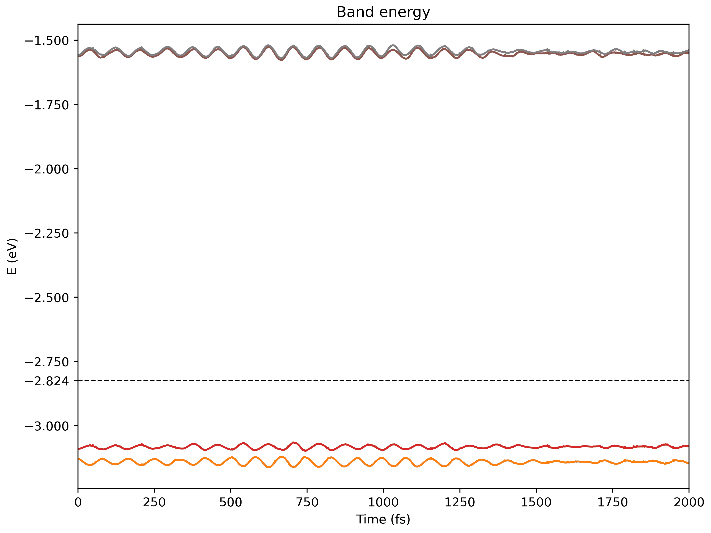
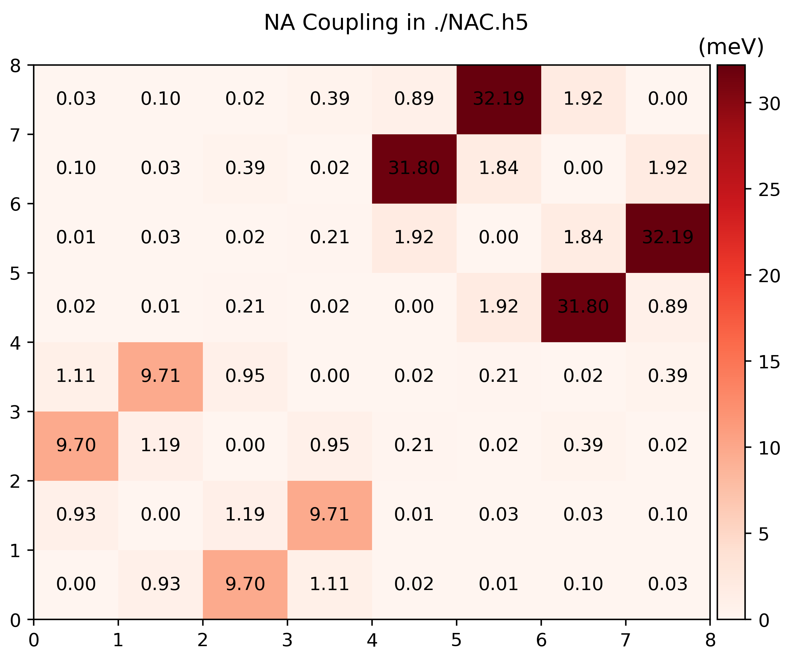

# Non-adiabatic Coupling

In Hefei-NAMD non-adiabatic coupling (NAC) is defined as the derivative of
wavefunctions

\begin{equation}
    \mathbf{D}\_{jk} = \mel{\phi\_j}{\dv{t}}{\phi\_k}
\end{equation}

where $\phi$ is the Kohn-Sham (KS) orbitals calculated by VASP.

To simulate photo-excitations process, momentum matrix element \\(\mathbf{P}\_{jk}
= \mel{j}{\mathbf{p}}{k}\\) is needed to calculate the light-matter interaction
(LMI) term

\begin{equation}
    \mathcal{H}\_{jk}^{\mathrm{LMI}} = -e \frac{\mathbf{A}}{m\_e} \mel{j}{\mathbf{p}}{k}
\end{equation}

in which $\mathbf{p}$ is the momentum opeartor, and \\(\mathbf{A}\\) is the vector potential
of external field.


**NOTE:** `namd_lmi` is capable of calculating both \\(\mathbf{D}\_{jk}\\) and \\(\mathbf{P}\_{jk}\\).

## Help message

```shell
$ namd_lmi nac
Calculate non-adiabatic coupling (NAC) including `<j| d/dt |k>` and momentum matrix `<i| p |j>`

Usage: namd_lmi nac [OPTIONS]

Options:
  -n, --nthreads <NTHREADS>
          Number of threads for parallel calculation.

          If 0 is set, it will fall back to the number of logic CPU cores of you machine.

          [default: 0]

  -c, --config <CONFIG>
          Config file name.

          Aliases: "cfg", "conf".

          [default: nac_config.toml]

      --generate <GENERATE>
          Generate auxiliary files for the calculation and analysis.

          The calculation will not run if this flag is set.

          Alias: "gen"

          Possible values:
          - config-template:      Generate config template for NAC calculation. Aliases: "config", "cfg", "conf"
          - postprocess-template: Generate post-process scripts for NAC analysis. Aliases: "post-process", "postprocess", "pp"

  -h, --help
          Print help (see a summary with '-h')
```

## Procedures

1. Generate a configuration template.
  	```shell
    $ namd_lmi nac --generate conf
  	2024-11-19 20:26:10 [ INFO] Global logger initialized with targets being stderr and "./globalrun.log"
  	2024-11-19 20:26:10 [ INFO] Writing `01_nac_config_template.toml ...`
    2024-11-19 20:26:10 [ INFO] Time used: 1.351249ms
    ```
    where the `01_nac_config_template.toml` reads
    ```shell
			 rundir = "../run"
			ikpoint = 1
			 brange = [0, 0]
				nsw = 2000
			 ndigit = 4
			  potim = 1
		temperature = 0
	phasecorrection = true
		   nacfname = "NAC.h5"
    ```

2. Modify the configuration according to your AIMD parameters.

    If you are familiar with the original Hefei-NAMD procedure, the parameters in
    `01_nac_config_template.toml` is not hard to understand:

    - `rundir` _string_: AIMD directory where thousands of SCF with WAVECARs lies within.
    - `ikpoint` _integer_: Which K point to choose, the index counts from `1`. For now, you
      can only choose one K point is selectable to calculate NAC and momentum
      matrix elements.
    - `brange` _[integer, integer]_: Selected band range for calculation. `[100, 120]` will select
      band from 100 to 120 to do the calculation, 21 bands in total.
    - `nsw` _integer_: Number of steps in AIMD. If there are `2000` steps in your `run/`,
      this field should be `2000`.
    - `ndigit` _integer_: Number of digits for the index of each step. If the directories in your
      `run/` are `00001` ... `02000`, this field should be 5.
    - `potim` _float_: Time step of the AIMD, consistent with the `POTIM` in INCAR during NVE.
    - `temperature` _float_: Temperature of the MD, consistent with the `TEEND` in INCAR during NVT.
    - `phasecorrection` _bool_: Do phase correction for the KS orbitals or not. Should be either
      `true` or `false`. Usually this term is essential for the photo-excitation process.
    - `nacfname` _string_: Output file name.

    **NOTE:** The _string_ fields must be surrounded with quotation mark `""`.

3. Do the coupling calculation.

    This process is quite simple
    ```shell
    $ namd_lmi nac -c 01_nac_config_template.toml
    2024-11-19 21:06:20 [ INFO] Global logger initialized with targets being stderr and "./globalrun.log"
    2024-11-19 21:06:20 [ INFO]
    +----------------------------------------------------------------------+
    |                                                                      |
    |    _   _            __  __  _____           _       __  __  _____    |
    |   | \ | |    /\    |  \/  ||  __ \         | |     |  \/  ||_   _|   |
    |   |  \| |   /  \   | \  / || |  | | ______ | |     | \  / |  | |     |
    |   | . ` |  / /\ \  | |\/| || |  | ||______|| |     | |\/| |  | |     |
    |   | |\  | / ____ \ | |  | || |__| |        | |____ | |  | | _| |_    |
    |   |_| \_|/_/    \_\|_|  |_||_____/         |______||_|  |_||_____|   |
    |                                                                      |
    +----------------------------------------------------------------------+

    Welcome to use namd!
        current version:    0.1.0
        git hash:           d659586
        author(s):          Ionizing
        host:               x86_64-unknown-linux-gnu
        built time:         2024-11-19 15:34:05 +08:00

    2024-11-19 21:06:20 [ INFO] Running with 0 threads.
    2024-11-19 21:06:20 [ INFO] Got NAC config:
    ####         NAMD-lmi config for Non-Adiabatic Coupling (NAC) calculation       ####
    ####    YOU NEED TO CHANGE THE PARAMETERS IN THE FOLLOWING TO FIT YOU SYSTEM    ####

                   rundir = "../../aimd/static_ncl_40/run/"
                  ikpoint = 1
                   brange = [213, 220]
                      nsw = 2000
                   ndigit = 4
                    potim = 1
              temperature = 300
          phasecorrection = true
                 nacfname = "NAC.h5"

    2024-11-19 21:06:20 [ INFO] No pre-calculated NAC available, start calculating from scratch in "../../aimd/static_ncl_40/run/"/.../WAVECARs ...
    2024-11-19 21:06:20 [ INFO]  Calculating couplings between "../../aimd/static_ncl_40/run/0001" and "../../aimd/static_ncl_40/run/0002" ..., remains:   1999
    2024-11-19 21:06:20 [ INFO]  Calculating couplings between "../../aimd/static_ncl_40/run/0312" and "../../aimd/static_ncl_40/run/0313" ..., remains:   1998
    2024-11-19 21:06:20 [ INFO]  Calculating couplings between "../../aimd/static_ncl_40/run/1000" and "../../aimd/static_ncl_40/run/1001" ..., remains:   1997
    2024-11-19 21:06:20 [ INFO]  Calculating couplings between "../../aimd/static_ncl_40/run/0218" and "../../aimd/static_ncl_40/run/0219" ..., remains:   1996
    2024-11-19 21:06:20 [ INFO]  Calculating couplings between "../../aimd/static_ncl_40/run/0078" and "../../aimd/static_ncl_40/run/0079" ..., remains:   1995
    2024-11-19 21:06:20 [ INFO]  Calculating couplings between "../../aimd/static_ncl_40/run/0132" and "../../aimd/static_ncl_40/run/0133" ..., remains:   1994
    ...
    2024-11-19 21:08:31 [ INFO]  Calculating couplings between "../../aimd/static_ncl_40/run/1370" and "../../aimd/static_ncl_40/run/1371" ..., remains:      5
    2024-11-19 21:08:31 [ INFO]  Calculating couplings between "../../aimd/static_ncl_40/run/1358" and "../../aimd/static_ncl_40/run/1359" ..., remains:      4
    2024-11-19 21:08:31 [ INFO]  Calculating couplings between "../../aimd/static_ncl_40/run/1216" and "../../aimd/static_ncl_40/run/1217" ..., remains:      3
    2024-11-19 21:08:31 [ INFO]  Calculating couplings between "../../aimd/static_ncl_40/run/1217" and "../../aimd/static_ncl_40/run/1218" ..., remains:      2
    2024-11-19 21:08:31 [ INFO]  Calculating couplings between "../../aimd/static_ncl_40/run/1215" and "../../aimd/static_ncl_40/run/1216" ..., remains:      1
    2024-11-19 21:08:32 [ INFO] Time used: 72.490979406s
    ```

    `namd_lmi nac` uses [`rayon`](https://github.com/rayon-rs/rayon) to utilize
    multi-threaded parallelism and you can specify the number of threads used by
    this command via `-n/--nthreads`. For example
    `namd_lmi -c 01_nac_config_template.toml -n 32` uses 32 threads to calculate
    the couplings.

4. Visualize couplings

    Run `namd_lmi nac --generate pp` to get a Python script to visualize the
    produced `NAC.h5`
    ```shell
    $ namd_lmi nac --generate pp
    2024-11-19 21:14:22 [ INFO] Global logger initialized with targets being stderr and "./globalrun.log"
    2024-11-19 21:14:22 [ INFO] Writing `nac_plot.py` ...
    2024-11-19 21:14:22 [ INFO] Time used: 1.241002ms 

    $ python3 ./nac_plot.py
    Writing nac_bands.png
    Writing nac_nac.png
    ```
    
    And the produced `.pngs` should look like
    
    
    

    You can modify `nac_plot.py` to visualize whatever you want.

## Data fields of `NAC.h5`

```
$ h5dump -H NAC.h5
HDF5 "NAC.h5" {
GROUP "/" {
   DATASET "brange" {
      DATATYPE  H5T_ARRAY { [2] H5T_STD_U64LE }
      DATASPACE  SCALAR
   }
   DATASET "efermi" {
      DATATYPE  H5T_IEEE_F64LE
      DATASPACE  SCALAR
   }
   DATASET "eigs" {
      DATATYPE  H5T_IEEE_F64LE
      DATASPACE  SIMPLE { ( 1999, 1, 8 ) / ( 1999, 1, 8 ) }
   }
   DATASET "ikpoint" {
      DATATYPE  H5T_STD_U64LE
      DATASPACE  SCALAR
   }
   DATASET "nbands" {
      DATATYPE  H5T_STD_U64LE
      DATASPACE  SCALAR
   }
   DATASET "nbrange" {
      DATATYPE  H5T_STD_U64LE
      DATASPACE  SCALAR
   }
   DATASET "ndigit" {
      DATATYPE  H5T_STD_U64LE
      DATASPACE  SCALAR
   }
   DATASET "nspin" {
      DATATYPE  H5T_STD_U64LE
      DATASPACE  SCALAR
   }
   DATASET "nsw" {
      DATATYPE  H5T_STD_U64LE
      DATASPACE  SCALAR
   }
   DATASET "olaps_i" {
      DATATYPE  H5T_IEEE_F64LE
      DATASPACE  SIMPLE { ( 1999, 1, 8, 8 ) / ( 1999, 1, 8, 8 ) }
   }
   DATASET "olaps_r" {
      DATATYPE  H5T_IEEE_F64LE
      DATASPACE  SIMPLE { ( 1999, 1, 8, 8 ) / ( 1999, 1, 8, 8 ) }
   }
   DATASET "phasecorrection" {
      DATATYPE  H5T_ENUM {
         H5T_STD_I8LE;
         "FALSE"            0;
         "TRUE"             1;
      }
      DATASPACE  SCALAR
   }
   DATASET "pij_i" {
      DATATYPE  H5T_IEEE_F64LE
      DATASPACE  SIMPLE { ( 1999, 1, 3, 8, 8 ) / ( 1999, 1, 3, 8, 8 ) }
   }
   DATASET "pij_r" {
      DATATYPE  H5T_IEEE_F64LE
      DATASPACE  SIMPLE { ( 1999, 1, 3, 8, 8 ) / ( 1999, 1, 3, 8, 8 ) }
   }
   DATASET "potim" {
      DATATYPE  H5T_IEEE_F64LE
      DATASPACE  SCALAR
   }
   DATASET "proj" {             // This part is cropped from PROCARs
      DATATYPE  H5T_IEEE_F64LE
      DATASPACE  SIMPLE { ( 1999, 4, 8, 36, 9 ) / ( 1999, 4, 8, 36, 9 ) }
   }
   DATASET "temperature" {
      DATATYPE  H5T_IEEE_F64LE
      DATASPACE  SCALAR
   }
}
}
```
