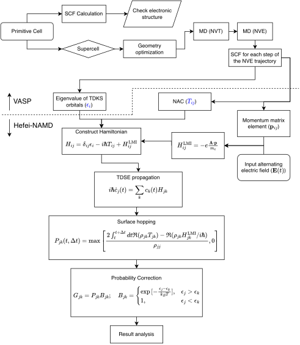

# Overall process

NAMD-LMI is divided into three parts: `nac`, `hamil` and `surfhop`, corresponding
to the calculation of non-adiabatic coupling, Hamiltonian and surface hopping.

1. Run VASP like traditional Hefei-NAMD;
2. Run `namd_lmi nac -c config` to calculate non-adiabatic coupling.
   A visualization script `nac_plot.py` is also available via `namd_lmi nac --generate pp`.
3. Run `namd_lmi hamil -c config` to generate Hamiltonian plus external field.
   The external field is described in a rhai script, which can be generated via
   `namd_lmi hamil --generate efield`.
   A visualization script `hamil_plot.py` is also available via `namd_lmi hamil --generate pp`.
4. Run `namd_lmi surfhop -c config` to run surface hopping and get the real time
   evolution of the population.
   A visualization script `surfhop_plot.py` is also available via `namd_lmi surfhop --generate pp`.

