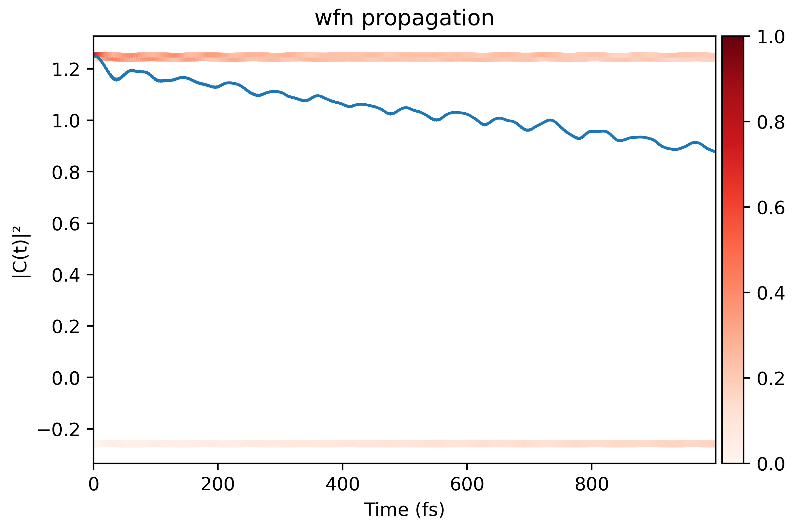
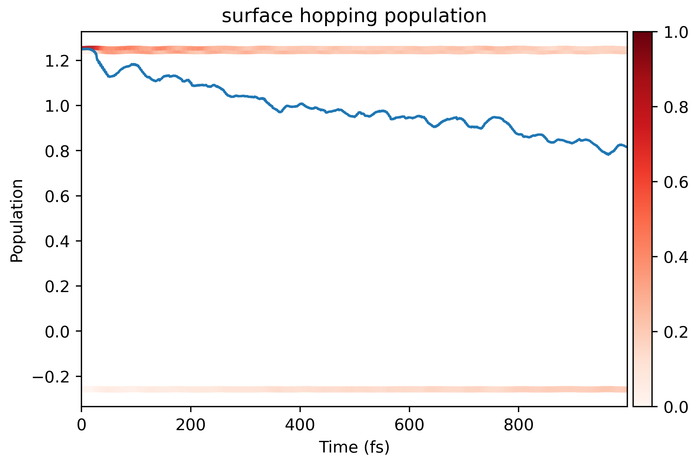

# Surface Hopping

This is the "literal" running process to simulate the dynamics of carriers. It ultilizes
the Fewest switches surface hopping (FSSH) algorithm under the classical path approximation
(CPA) to estimate the real-time population of each state. The hopping probability reads

\begin{equation}
    P\_{j\to k}(t, t+\Delta t) = \max \qty{-2 \Delta t \qty(
    -\frac{\Re(\rho\_{jk} D_{jk})}{\rho\_{jj}} + \frac{ \Re(\rho\_{jk} H\_{jk}^{LMI} / i\hbar)}{\rho\_{jj}}
), 0}
\end{equation}

The formalism of FSSH is consistent with
previous studies:

- J. Chem. Theory Comput. 2013, 9, 11, 4959–4972
- J. Chem. Theory Comput. 2014, 10, 2, 789–804
- WIREs Comput Mol Sci. 2019;9:e1411.


## Help message

```shell
$ namd_lmi surfhop --help
Perform the surface-hopping process with given Hamiltonian file and config file

Usage: namd_lmi surfhop [OPTIONS]

Options:
  -n, --nthreads <NTHREADS>
          Number of threads for parallel calculation.

          If 0 is set, it will fall back to the number of logic CPU cores of you machine.

          [default: 0]

  -c, --config <CONFIG>
          Config file name.

          Aliases: "cfg", "conf".

      --generate <GENERATE>
          Generate auxiliary files for the calculation and analysis.

          The surface-hopping will not run if this flag is set.

          Alias: "gen".

          Possible values:
          - config-template:      Generate config template for Hamiltonian generation. Aliases: "config", "cfg" and "conf"
          - inistep.py:           Generate Python script to help append `inistep` field. Aliases: "inistep" and "ini"
          - postprocess-template: Generate post-process scripts for surface-hopping analysis. Aliases: "post-process", "postprocess", "pp"

      --collect-results <COLLECT_RESULTS>
          Collect results produced by the surface-hopping.

          The surface-hopping will not run if this flag is set.

          Aliases: "collect", "cr"

  -h, --help
          Print help (see a summary with '-h')
```

## Procedures

1. Generate configuration file, and auxiliary Python script.

    ```shell
    $ namd_lmi surfhop --generate conf
    2024-11-20 20:59:21 [ INFO] Global logger initialized with targets being stderr and "./globalrun.log"
    2024-11-20 20:59:21 [ INFO] writing `03_surfhop_config_template.toml` ...
    2024-11-20 20:59:21 [ INFO] Writing `inisteps.py` ...
    2024-11-20 20:59:21 [ INFO] Time used: 13.977617ms

    $ namd_lmi surfhop --generate pp
    2024-11-20 20:59:30 [ INFO] Global logger initialized with targets being stderr and "./globalrun.log"
    2024-11-20 20:59:30 [ INFO] Writing `surfhop_plot.py` ...
    2024-11-20 20:59:30 [ INFO] Time used: 1.534094ms
    ```

2. Modify the Surface Hopping configuration file

    ```toml
    ####             NAMD-lmi config for surface-hopping calculation            ####
    #### YOUT NEED TO CHANGE THE PARAMETERS IN THE FOLLOWING TO FIT YOUR SYSTEM ####

              hamil_fname = "HAMIL.h5"
                 namdtime = 1000
                     nelm = 10
                    ntraj = 10000
                 shmethod = "FSSH"

                   outdir = "outdir"
         detailed_balance = "DependsOnEField"
          smearing_method = "LorentzianSmearing"
           smearing_sigma = 0.01
     smearing_npoints_per_eV = 500

                  iniband = 0
                 inisteps = [
             1 ,
             2 ,
             3 ,
    ]
    ```

    Explanation of each field:

    - `hamil_fname` _string_: Hamiltonian file name.
    - `namdtime` _integer_: Total NAMD simulate steps.
    - `nelm` _integer_: How many electronic steps within each ionic step.
        
        For `propmethod = "FiniteDifference"` in Hamiltonian, this field
        is required to be large, i.e. `nelm = 1000`. Otherwise, `nelm = 10` is enough.

    - `ntraj` _integer_: How many times to hop for each MD trajectory.
    - `shmethod` _string_: Which surface hopping method to use. Only "FSSH" is available for now.
    - `outdir` _string_: Output directory where the results will be written in. **This field
        cannot be current dir ".".**
    - `detailed_balance` _string_: When the "detailed balance" factor \\(B = e^{\Delta E / k_B T}\\)
        applied on the upward hopping (hopping from lower energy to higher energy) probability.

        Available options:
        - "Always": Always apply factor \\(B\\).
        - "DependsOnEfield": Apply factor \\(B\\) only when external field is present, to allow upward
            hoppings.
        - "NacOnly": Apply factor \\(B\\) only for NAC driven upward hoppings, meaning that only phonon
            (plus SOC) induced upward hoppings are restricted.
        - "Never": Never apply this factor, no limitation on all upward hoppings.

    - `smearing_method` _string_: Smearing function for phonon spectra calculation.

        Available options:
        - "LorentzianSmearing"/"Lorentzian"/"lorentzian"
        - "GaussianSmearing"/"Gaussian"/"gaussian"

    - `smearing_sigma` _float_: Literal smearing width of smearing functions.
    - `smearing_npoints_per_eV` _integer_: Point density for spectra data.
    - `iniband` _integer_: Initial band where the electron lies on. The index is consistent
       with `nac` and `hamil`.
        
        For example, if `basis_list = [215..220]`, and we want the electron on band 220 initially,
        this field should be `iniband = 220`.

    - `inisteps` _list of integer_: Initial step index for each NAMD sample trajectory.

        There are only 3 samples as shown in `inisteps` field, which is far from enough. Run `python3 inisteps.py
        03_surfhop_config_template.toml 1999 100` to generate 100 random initial configurations for the surface
        hopping method. Then delete the original `inisteps` and it finally reads

        ```toml
        ...
        ...
         smearing_npoints_per_eV = 500

                      iniband = 0
        ## Appended by inisteps.py @ 2024-11-20 22:42:28
                    inisteps = [
                13 ,
                64 ,
                78 ,
        ...
        ...
              1965 ,
              1982 ,
              1993
        ]
        ```

3. Run the surface hopping.

```shell
$ namd_lmi surfhop -c 03_surfhop_config_template.toml
2024-11-21 10:08:20 [ INFO] Global logger initialized with targets being stderr and "./globalrun.log"
2024-11-21 10:08:20 [ INFO]
+----------------------------------------------------------------------+
|                                                                      |
|    _   _            __  __  _____           _       __  __  _____    |
|   | \ | |    /\    |  \/  ||  __ \         | |     |  \/  ||_   _|   |
|   |  \| |   /  \   | \  / || |  | | ______ | |     | \  / |  | |     |
|   | . ` |  / /\ \  | |\/| || |  | ||______|| |     | |\/| |  | |     |
|   | |\  | / ____ \ | |  | || |__| |        | |____ | |  | | _| |_    |
|   |_| \_|/_/    \_\|_|  |_||_____/         |______||_|  |_||_____|   |
|                                                                      |
+----------------------------------------------------------------------+

Welcome to use namd!
    current version:    0.1.0
    git hash:           a51d001
    author(s):          Ionizing
    host:               x86_64-unknown-linux-gnu
    built time:         2024-11-20 16:02:14 +08:00

2024-11-21 10:08:20 [ INFO] Prepare to run surface-hopping in 0 threads ...
2024-11-21 10:08:20 [ INFO] Log and output files will be stored in "outdir" .
2024-11-21 10:08:20 [ INFO] Got Surface Hopping config:
####             NAMD-lmi config for surface-hopping calculation            ####
#### YOUT NEED TO CHANGE THE PARAMETERS IN THE FOLLOWING TO FIT YOUR SYSTEM ####

          hamil_fname = "HAMIL.h5"
             namdtime = 1000
                 nelm = 10
                ntraj = 10000
             shmethod = "FSSH"

               outdir = "outdir"
     detailed_balance = "DependsOnEField"
      smearing_method = "LorentzianSmearing"
       smearing_sigma = 0.01
 smearing_npoints_per_eV = 500

              iniband = 220
             inisteps = [
        13 ,
        64 ,
        78 ,
...
...
      1965 ,
      1982 ,
      1993 ,
]

2024-11-21 10:08:20 [ INFO] Linking Hamiltonian file "HAMIL.h5" to "outdir"
2024-11-21 10:08:20 [ INFO] Writing electric field source file to efield.rhai ...
2024-11-21 10:08:20 [ INFO] Writing electric field to "outdir/EAFIELD.txt" ...
2024-11-21 10:08:20 [ INFO] Running surface hopping with namdinit = 81 ...
2024-11-21 10:08:20 [ INFO] Running surface hopping with namdinit = 625 ...
2024-11-21 10:08:20 [ INFO] Running surface hopping with namdinit = 896 ...
...
...
2024-11-21 10:08:22 [ INFO] Running surface hopping with namdinit = 457 ...
2024-11-21 10:08:22 [ INFO] Running surface hopping with namdinit = 478 ...
2024-11-21 10:08:22 [ INFO] Running surface hopping with namdinit = 430 ...
2024-11-21 10:08:22 [ INFO] Collecting results ...
2024-11-21 10:08:22 [ INFO] Processing "outdir/result_0013.h5" ...
2024-11-21 10:08:22 [ INFO] Processing "outdir/result_0081.h5" ...
2024-11-21 10:08:22 [ INFO] Processing "outdir/result_0925.h5" ...
...
...
2024-11-21 10:08:23 [ INFO] Processing "outdir/result_1872.h5" ...
2024-11-21 10:08:23 [ INFO] Processing "outdir/result_0689.h5" ...
2024-11-21 10:08:23 [ INFO] Processing "outdir/result_1529.h5" ...
2024-11-21 10:08:23 [ INFO] Collecting done. Writing to "outdir/averaged_results.h5" ...
2024-11-21 10:08:23 [ INFO] Time used: 3.848758855s
```

4. Visualize results

Generate the visualization script and then run it.

```shell
$ namd_lmi surfhop --generate pp
2024-11-21 10:12:03 [ INFO] Global logger initialized with targets being stderr and "./globalrun.log"
2024-11-21 10:12:03 [ INFO] Writing `surfhop_plot.py` ...
2024-11-21 10:12:03 [ INFO] Time used: 1.444398ms

$ cd outdir && python3 ../surfhop_plot.py
03_surfhop_config_template.toml  result_0282.h5  result_0625.h5  result_0859.h5  result_1240.h5  result_1656.h5
averaged_results.h5              result_0291.h5  result_0669.h5  result_0896.h5  result_1263.h5  result_1658.h5
EAFIELD.txt                      result_0293.h5  result_0680.h5  result_0925.h5  result_1297.h5  result_1715.h5
efield.rhai                      result_0301.h5  result_0685.h5  result_0947.h5  result_1309.h5  result_1733.h5
HAMIL.h5                         result_0302.h5  result_0686.h5  result_0949.h5  result_1310.h5  result_1745.h5
result_0013.h5                   result_0311.h5  result_0689.h5  result_0979.h5  result_1326.h5  result_1764.h5
result_0064.h5                   result_0336.h5  result_0725.h5  result_1014.h5  result_1336.h5  result_1834.h5
result_0078.h5                   result_0365.h5  result_0726.h5  result_1019.h5  result_1376.h5  result_1872.h5
result_0081.h5                   result_0429.h5  result_0749.h5  result_1020.h5  result_1382.h5  result_1886.h5
result_0087.h5                   result_0430.h5  result_0758.h5  result_1023.h5  result_1416.h5  result_1923.h5
result_0099.h5                   result_0457.h5  result_0759.h5  result_1049.h5  result_1432.h5  result_1950.h5
result_0153.h5                   result_0478.h5  result_0760.h5  result_1064.h5  result_1435.h5  result_1957.h5
result_0154.h5                   result_0508.h5  result_0789.h5  result_1072.h5  result_1522.h5  result_1965.h5
result_0183.h5                   result_0524.h5  result_0790.h5  result_1078.h5  result_1529.h5  result_1982.h5
result_0207.h5                   result_0541.h5  result_0792.h5  result_1091.h5  result_1532.h5  result_1993.h5
result_0214.h5                   result_0546.h5  result_0817.h5  result_1119.h5  result_1572.h5  run.log
result_0238.h5                   result_0549.h5  result_0818.h5  result_1133.h5  result_1587.h5  surfhop.png
result_0244.h5                   result_0618.h5  result_0837.h5  result_1159.h5  result_1616.h5  wfn_propagation.png
```

The coefficient propagation should looks like 

And the surface hopping result looks like 


## Data fields of `result_xxxx.h5` and `averaged_results.h5`

```shell
$ h5dump -H result_0013.h5
HDF5 "result_0013.h5" {
GROUP "/" {
   DATASET "basis_labels" {
      DATATYPE  H5T_STD_U8LE
      DATASPACE  SIMPLE { ( 31 ) / ( 31 ) }
   }
   DATASET "basis_list" {
      DATATYPE  H5T_STD_I32LE
      DATASPACE  SIMPLE { ( 6 ) / ( 6 ) }
   }
   DATASET "detailed_balance" {
      DATATYPE  H5T_STD_U8LE
      DATASPACE  SIMPLE { ( 15 ) / ( 15 ) }
   }
   DATASET "namdinit" {
      DATATYPE  H5T_STD_U64LE
      DATASPACE  SCALAR
   }
   DATASET "namdtime" {
      DATATYPE  H5T_STD_U64LE
      DATASPACE  SCALAR
   }
   DATASET "ntraj" {
      DATATYPE  H5T_STD_U64LE
      DATASPACE  SCALAR
   }
   DATASET "prop_energy" {
      DATATYPE  H5T_IEEE_F64LE
      DATASPACE  SIMPLE { ( 1000 ) / ( 1000 ) }
   }
   DATASET "psi_t_i" {
      DATATYPE  H5T_IEEE_F64LE
      DATASPACE  SIMPLE { ( 1000, 6 ) / ( 1000, 6 ) }
   }
   DATASET "psi_t_r" {
      DATATYPE  H5T_IEEE_F64LE
      DATASPACE  SIMPLE { ( 1000, 6 ) / ( 1000, 6 ) }
   }
   DATASET "sh_energy" {
      DATATYPE  H5T_IEEE_F64LE
      DATASPACE  SIMPLE { ( 1000 ) / ( 1000 ) }
   }
   DATASET "sh_phonons_t" {
      DATATYPE  H5T_IEEE_F64LE
      DATASPACE  SIMPLE { ( 1000, 6, 6 ) / ( 1000, 6, 6 ) }
   }
   DATASET "sh_photons_t" {
      DATATYPE  H5T_IEEE_F64LE
      DATASPACE  SIMPLE { ( 1000, 6, 6 ) / ( 1000, 6, 6 ) }
   }
   DATASET "sh_pops" {
      DATATYPE  H5T_IEEE_F64LE
      DATASPACE  SIMPLE { ( 1000, 6 ) / ( 1000, 6 ) }
   }
   DATASET "shmethod" {
      DATATYPE  H5T_STD_U8LE
      DATASPACE  SIMPLE { ( 5 ) / ( 5 ) }
   }
   DATASET "time" {
      DATATYPE  H5T_IEEE_F64LE
      DATASPACE  SIMPLE { ( 1000 ) / ( 1000 ) }
   }
}
}

$ h5dump -H averaged_results.h5
HDF5 "averaged_results.h5" {
GROUP "/" {
   DATASET "basis_labels" {
      DATATYPE  H5T_STD_U8LE
      DATASPACE  SIMPLE { ( 31 ) / ( 31 ) }
   }
   DATASET "basis_list" {
      DATATYPE  H5T_STD_I32LE
      DATASPACE  SIMPLE { ( 6 ) / ( 6 ) }
   }
   DATASET "delta_et" {
      DATATYPE  H5T_IEEE_F64LE
      DATASPACE  SIMPLE { ( 21, 1999 ) / ( 21, 1999 ) }
   }
   DATASET "eigs_t" {
      DATATYPE  H5T_IEEE_F64LE
      DATASPACE  SIMPLE { ( 1000, 6 ) / ( 1000, 6 ) }
   }
   DATASET "ndigit" {
      DATATYPE  H5T_STD_U64LE
      DATASPACE  SCALAR
   }
   DATASET "phonon_spectra_frequencies" {
      DATATYPE  H5T_IEEE_F64LE
      DATASPACE  SIMPLE { ( 1000 ) / ( 1000 ) }
   }
   DATASET "phonons_absp_t" {
      DATATYPE  H5T_IEEE_F64LE
      DATASPACE  SIMPLE { ( 1000, 1000 ) / ( 1000, 1000 ) }
   }
   DATASET "phonons_emit_t" {
      DATATYPE  H5T_IEEE_F64LE
      DATASPACE  SIMPLE { ( 1000, 1000 ) / ( 1000, 1000 ) }
   }
   DATASET "phonons_spectra" {
      DATATYPE  H5T_IEEE_F64LE
      DATASPACE  SIMPLE { ( 21, 1000 ) / ( 21, 1000 ) }
   }
   DATASET "photon_spectra_xvals" {
      DATATYPE  H5T_IEEE_F64LE
      DATASPACE  SIMPLE { ( 1400 ) / ( 1400 ) }
   }
   DATASET "photons_absp_t" {
      DATATYPE  H5T_IEEE_F64LE
      DATASPACE  SIMPLE { ( 1000, 1400 ) / ( 1000, 1400 ) }
   }
   DATASET "photons_emit_t" {
      DATATYPE  H5T_IEEE_F64LE
      DATASPACE  SIMPLE { ( 1000, 1400 ) / ( 1000, 1400 ) }
   }
   DATASET "potim" {
      DATATYPE  H5T_IEEE_F64LE
      DATASPACE  SCALAR
   }
   DATASET "proj_t" {
      DATATYPE  H5T_IEEE_F64LE
      DATASPACE  SIMPLE { ( 1000, 6, 36, 9 ) / ( 1000, 6, 36, 9 ) }
   }
   DATASET "prop_energy" {
      DATATYPE  H5T_IEEE_F64LE
      DATASPACE  SIMPLE { ( 1000 ) / ( 1000 ) }
   }
   DATASET "psi_t" {
      DATATYPE  H5T_IEEE_F64LE
      DATASPACE  SIMPLE { ( 1000, 6 ) / ( 1000, 6 ) }
   }
   DATASET "sh_energy" {
      DATATYPE  H5T_IEEE_F64LE
      DATASPACE  SIMPLE { ( 1000 ) / ( 1000 ) }
   }
   DATASET "sh_phonons_t" {
      DATATYPE  H5T_IEEE_F64LE
      DATASPACE  SIMPLE { ( 1000, 6, 6 ) / ( 1000, 6, 6 ) }
   }
   DATASET "sh_photons_t" {
      DATATYPE  H5T_IEEE_F64LE
      DATASPACE  SIMPLE { ( 1000, 6, 6 ) / ( 1000, 6, 6 ) }
   }
   DATASET "sh_pops" {
      DATATYPE  H5T_IEEE_F64LE
      DATASPACE  SIMPLE { ( 1000, 6 ) / ( 1000, 6 ) }
   }
   DATASET "time" {
      DATATYPE  H5T_IEEE_F64LE
      DATASPACE  SIMPLE { ( 1000 ) / ( 1000 ) }
   }
}
}
```
